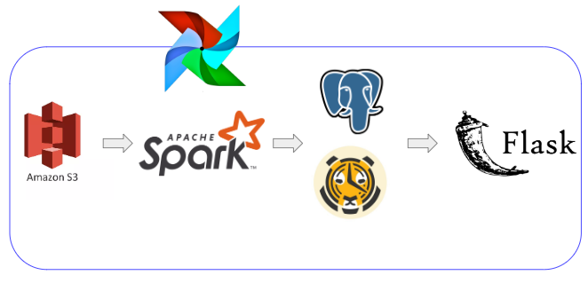
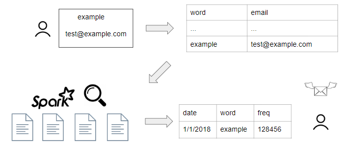
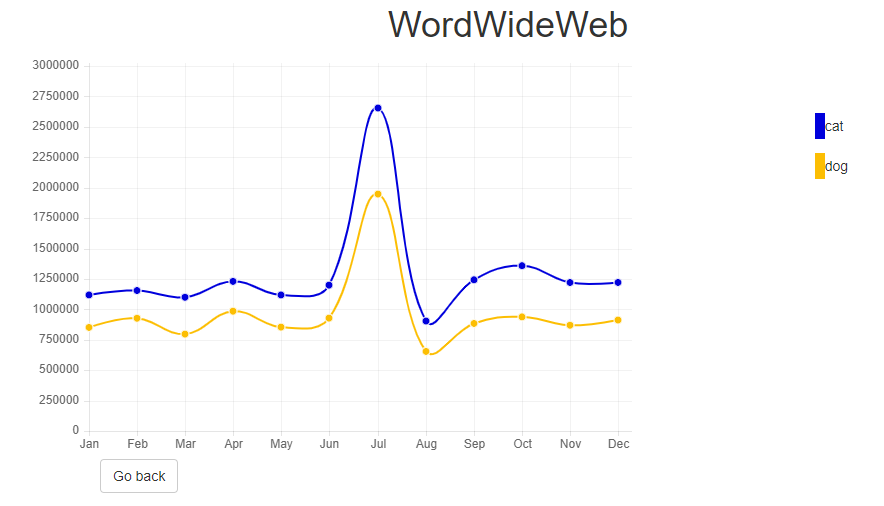

# WordWideWeb

### Table of Contents
1. [Introduction](#introduction)
2. [Dataset](#dataset)
3. [Pipeline](#pipeline)
4. [Airflow](#airflow)
5. [Installation](#installation)
6. [Website](#website)

### Introduction
There are billions of webpages that exist on the Internet, with just as many more being created as the years go on. In order to anticipate which topics will be talked about in the future, one would want to know what has already been discussed. Advertisers may wish to know for the sake of promoting specific products over others. However, scraping data from webpages is an arduous and time-consuming process that may deter people.

### Dataset


The [Common Crawl](https://commoncrawl.org/the-data/) dataset was used for this project, which scrapes the Internet for webpage data and makes it publically available at the end of each month.
A random sampling of 250 files per month were taken from 2018, where each file is about 350MB worth of text.

### Pipeline


Data was pulled from S3, word frequencies were computed through Spark and stored into PostgreSQL with TimescaleDB configurations. The web application was built with Flask, and Airflow is used to orchestrate jobs that are run by the user to query new words.

The structure of the directory is as follows:
```
WordWideWeb
    |- spark
        |- ingestion.py
        |- paths.config
    |- airflow
        |- monthly_process.py
    |- website
        |- site.py
        |- templates
            |- ...
```

### Airflow


When the user schedules a job, a row will be added with the corresponding word and user-inputted email to a table `requests`. This will trigger an SQL sensor on the Airflow scheduler, as the table is no longer empty. The row will then be removed, and Spark jobs will be submitted in order to obtain the data for how often the word appeared. Once these Spark jobs are complete, the user will be notified via email.

### Installation

1. Set up EC2 instances Part 1 (Spark cluster)
   - Install the AWS CLI tool, as well as the Pegasus tool to set up an EC2 cluster through [this guide](https://blog.insightdatascience.com/how-to-get-hadoop-and-spark-up-and-running-on-aws-7a1b0ab55459). In this case, 1 master node and 3 worker nodes were set up in the workers.yml and master.yml files. Also install Spark and Hadoop and begin the services/cluster.
   - ssh into each EC2 instance using `peg ssh <cluster-name> <number>` and install jets3t library to use Spark properly using the following commands:
     - `wget http://bitbucket.org/jmurty/jets3t/downloads/jets3t-0.9.4.zip`
     - `unzip ./jets3t-0.9.4.zip`
     - `cp ./jets3t-0.9.4/jars/jets3t-0.9.4.jar $SPARK_HOME/jars`
     
2. Set up EC2 instances Part 2 (Database instance)
   - PostgreSQL database will be installed on a separate m4.large EC2 instance
   - Follow installation for PostgreSQL + TimescaleDB [here](https://docs.timescale.com/latest/getting-started/installation/ubuntu/installation-apt-ubuntu).
   - Create one table for word frequencies and one table for handling requests.
     - Word frequencies table has columns freq_id (varchar), date (date), word (varchar), frequency (integer)
     - Requests table has columns word (varchar), email (varchar)
     - Create hypertable on word frequencies table on the date column
   - Set up database credentials in Spark EC2 instances (credentials.txt will be in the main folder)
   
3. Set up Airflow
   - Install Airflow through `pip3 install apache-airflow`
   - Make sure the DAG definition file (monthly_process.py) is moved to the airflow/dags folder, and run the webserver/scheduler
   - `airflow webserver`
   - `airflow scheduler`

4. Run Flask app
   - Make sure the dependencies have been installed in the corresponding EC2 instance where the website will be run.
   - Under root user in the main folder run `gunicorn -b 0.0.0.0:80 -w 4 website.site:app`
   
### Website


The website is available at [lensoftruth.me](http://lensoftruth.me).

A video demonstration of the website can be found [here](https://www.youtube.com/watch?v=Av9hMJEIFzg).
